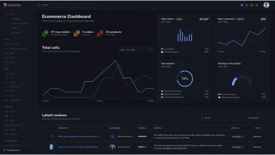
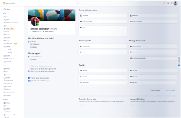

# 🛒 Paid Admin E-Commerce Dashboard

A modern, responsive **Admin Dashboard for E-Commerce platforms** built using pure HTML, CSS, and JavaScript.  
This dashboard is designed for managing products, orders, users, analytics, and payments efficiently.

---

## 🚀 Features

- 📊 Interactive Dashboard UI
- 🛍️ Product Management
- 📦 Order Tracking System
- 👥 User Management
- 💳 Payment Overview
- 📈 Sales Analytics (charts & reports)
- 🔐 Admin Authentication UI
- 📱 Fully Responsive Design

---

## 🛠️ Tech Stack

- React js
- vite js

---

## 📸 Screenshots

### Dashboard Overview

### Product Management

### Profile Page

---

## 💻 Installation & Usage

1. Clone the repository:

git clone https://github.com/Ajith739/Paid-Admin-E-com-dashboard-Html.git

2. Open the project folder:

cd Paid-Admin-E-com-dashboard-Html

3. Run the project:
- Simply open `index.html` in your browser

---

## 📌 Future Improvements

- Backend integration (Laravel / Node.js)
- API-based data fetching
- Role-based authentication
- Payment gateway integration

---

## 📄 License

This project is licensed for **paid use only**.  
Unauthorized distribution or resale is prohibited.

---

## 👨‍💻 Author

Developed by **Ajith**
